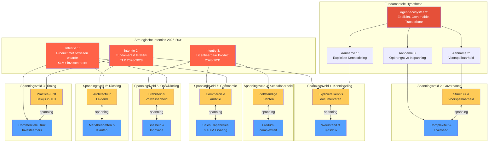

# Strategische Spanningsvelden — Product Mandarin

**Datum**: 2026-02-07  
**Auteur**: Strategisch Analist  
**Input**:
- [Fundamentele Hypothese](fundamentele-hypothese.md)
- [Strategische Intenties](strategische-intenties.md)

---

## Samenvatting

Dit document identificeert en analyseert de strategische spanningsvelden die voortkomen uit de fundamentele hypothese en strategische intenties van Product Mandarin. Deze spanningsvelden zijn inherent aan de ontwikkelrichting en vereisen bewuste keuzes en afwegingen gedurende de ontwikkeling (2026-2031).

---

## Geïdentificeerde Spanningsvelden

### 1. Expliciete Kennisdeling ↔ Weerstand & Tijdsdruk

**Beschrijving**  
Het agent-ecosysteem vereist dat IT-professionals hun kennis expliciet maken en werken met contracten en governance. Tegelijkertijd kan weerstand of tijdsdruk deze bereidheid belemmeren.

**Bron in Hypothese**  
- **Aanname 1**: "IT-professionals zijn bereid om hun kennis expliciet te maken"
- **Risico**: "Niet alle professionals willen of kunnen hun kennis expliciet maken"

**Bron in Intenties**  
- **Intentie 2**: "Architectuur expliciteren, governance verbeteren, werkprocessen optimaliseren"
- Vereist continue investering in documentatie en kennisdeling

**Impact**  
- **Positief**: Expliciete kennis maakt product overdraagbaar en schaalbaar
- **Negatief**: Kan als overhead ervaren worden, vertraagt initiële adoptie
- **Kritisch**: Zonder expliciete kennis faalt het fundamentele waardevoorstel

**Afwegingen**  
- Balans tussen volledigheid en pragmatisme in documentatie
- Tooling en processen die kennisdeling faciliteren (niet belemmeren)
- Cultuurverandering vs. directe productiviteitsdruk

---

### 2. Structuur & Governance ↔ Complexiteit & Overhead

**Beschrijving**  
Het ecosysteem introduceert governance, boundaries en contracten voor voorspelbaarheid. Dit brengt inherent complexiteit en overhead met zich mee.

**Bron in Hypothese**  
- **Aanname 2**: "Extra structuur leidt mogelijk niet tot betere voorspelbaarheid, of het systeem wordt te complex"
- **Aanname 3**: "Extra governance kan als overhead worden ervaren"

**Bron in Intenties**  
- **Intentie 1**: Product moet "uitlegbaar" en "overdraagbaar" zijn
- **Intentie 3**: "Governance-templates zijn beschikbaar" voor klanten

**Impact**  
- **Positief**: Voorspelbaarheid, traceerbaarheid, lagere foutfrequentie
- **Negatief**: Leercurve, initiële traagheid, perceptie van bureaucratie
- **Kritisch**: Als governance niet intuïtief is, faalt adoptie

**Afwegingen**  
- Minimaal viable governance vs. volledige controle
- Progressieve onboarding: start eenvoudig, voeg complexiteit toe waar nodig
- Governance als enabler (niet als bottleneck)

---

### 3. Practice-First ↔ Commerciële Druk & Investeerder-Interesse

**Beschrijving**  
De strategie vereist eerst praktijkbewijs in TLX (2026-2028) vóór commercialisatie, terwijl het doel is investeerder-interesse (€1M+) en een verkoopbaar product binnen vijf jaar.

**Bron in Hypothese**  
- Impliciete aanname: product moet bewezen effectiviteit tonen vóór schaalbare verkoop

**Bron in Intenties**  
- **Intentie 1**: "Binnen vijf jaar een verkoopbaar, bewezen product" met "investeerder-interesse > €1 miljoen"
- **Intentie 2**: "Practice-first" in TLX, geen "directe commercialisatie zonder praktijkbewijs"
- **Horizon**: Fase 1 (2026-2028) moet leiden tot Scenario A (2028-2031)

**Impact**  
- **Positief**: Diepgaand bewijs, volwassen product, vertrouwen bij investeerders
- **Negatief**: Vertraagde time-to-market, concurrentierisico, financiële druk
- **Kritisch**: Tijdshorizon van 5 jaar is ambitieus bij practice-first benadering

**Afwegingen**  
- Fasering: minimaal viable product (MVP) na Fase 1 vs. volledig volwassen product
- Early adopters identificeren die bereid zijn te investeren in nog-ontwikkelend product
- Communicatie naar investeerders: practice-first als kwaliteitsborging (niet vertraging)

---

### 4. Zelfstandigheid Klant ↔ Productcomplexiteit & Support

**Beschrijving**  
Het doel is dat klanten zelfstandig met Mandarin kunnen werken (Intentie 3), terwijl het ecosysteem inherent complexiteit en governance vereist.

**Bron in Hypothese**  
- Kernwaarde: "expliciet, governable en traceerbaar" vereist begrip en vaardigheden

**Bron in Intenties**  
- **Intentie 1**: "Klanten kunnen zelf verantwoordelijkheid dragen"
- **Intentie 3**: "Geen volledige afhankelijkheid van Mandarin-team"
- Vereist: "Documentatie en onboarding van hoge kwaliteit", "governance-templates"

**Impact**  
- **Positief**: Schaalbaar model, lagere support-kosten, empowered klanten
- **Negatief**: Hoge eisen aan documentatie, training en onboarding
- **Kritisch**: Zonder zelfstandigheid schaalt het business model niet

**Afwegingen**  
- Investering in self-service tooling, templates en documentatie
- Tiered support model: basis = zelfstandig, premium = hands-on guidance
- Community-building: peer-to-peer kennisdeling tussen klanten

---

### 5. Snelheid & Innovatie ↔ Stabiliteit & Volwassenheid

**Beschrijving**  
Er is druk om snel te innoveren en te groeien, terwijl stabiliteit en volwassenheid essentieel zijn voor vertrouwen en investeerder-interesse.

**Bron in Hypothese**  
- **Aanname 2**: "Elke groeistap vereist bewijs van waarde, stabiliteit, herhaalbaarheid"

**Bron in Intenties**  
- **Intentie 1**: "Stabiliteit, herhaalbaarheid" als kerneisen
- **Intentie 2**: "Continue verbetering van architectuur, governance en werkprocessen"
- **Intentie 3**: "Productvolwassenheid wordt bereikt" vóór licentieverkoop

**Impact**  
- **Positief**: Vertrouwen, lage churn, goede reputatie
- **Negatief**: Langzamere feature releases, mogelijk gemiste kansen
- **Kritisch**: Prematuur schalen zonder stabiliteit vernietigt vertrouwen

**Afwegingen**  
- Feature freeze periodes voor stabilisatie en testing
- Dual track: innovatie in R&D, stabiliteit in productie
- Transparantie naar klanten: roadmap met duidelijke stabiliteit-milestones

---

### 6. Architectuur als Leidend Principe ↔ Marktdruk & Klantbehoeften

**Beschrijving**  
De strategie stelt dat "architectuur is leidend voor commercialisatie", terwijl de markt en klanten mogelijk andere prioriteiten hebben.

**Bron in Hypothese**  
- Impliciete aanname: architectuur bepaalt wat technisch verantwoord is

**Bron in Intenties**  
- **Intentie 1**: "Architectuur is leidend voor commercialisatie"
- **Intentie 2**: "Architectuur wordt expliciet en overdraagbaar gemaakt"

**Impact**  
- **Positief**: Duurzaam product, technische schuld wordt voorkomen
- **Negatief**: Mogelijk langzamere respons op marktbehoeften, feature requests
- **Kritisch**: Te starre focus op architectuur kan leiden tot product-market misfit

**Afwegingen**  
- Architectuur als constraint (niet als dictatuur): ruimte voor pragmatisme
- Regular architecture reviews met klant-feedback als input
- "Architecture as enabler": laat zien hoe goede architectuur klantwaarde versnelt

---

### 7. Commerciële Ambitie ↔ Sales Capabilities & Go-to-Market Ervaring

**Beschrijving**  
De strategie vereist binnen vijf jaar een verkoopbaar product met €1M+ investeerder-interesse en later licentieverkoop, terwijl de organisatie onvoldoende sales capabilities en go-to-market ervaring in huis heeft.

**Bron in Hypothese**  
- Impliciete aanname: bewezen waarde moet ook verkocht kunnen worden aan klanten en investeerders

**Bron in Intenties**  
- **Intentie 1**: "Binnen vijf jaar een verkoopbaar, bewezen product" met "investeerder-interesse > €1 miljoen"
- **Intentie 3**: "Verkoop van licenties, ondersteuning, training, advies" (2028-2031)
- Vereist: Commerciële strategie, pricing, marketing, sales proces

**Impact**  
- **Positief**: Focus blijft op product/architectuur (niet afgeleid door vroege sales)
- **Negatief**: Risico op gemiste kansen, late market entry, onderschatting van sales-cyclus
- **Kritisch**: Technisch sterk product zonder sales capabilities haalt Intentie 1 niet

**Afwegingen**  
- **Build**: Intern sales team opbouwen (kostbaar, tijdrovend)
- **Buy**: Sales expertise inhuren (duur, culturele fit onzeker)
- **Partner**: Samenwerking met sales-partners (verlies van control, marges)
- **Hybrid**: Minimale interne sales + externe adviseurs voor early deals
- Timing: wanneer investeren in sales (te vroeg = overhead, te laat = gemiste momentum)

**Mitigerende acties**  
- Practice-first in TLX levert case studies en referenties (sales enablement)
- Investeerder-netwerk vroeg activeren voor warm leads en intro's
- Sales readiness assessment na Fase 1 (2028): go/no-go criteria voor sales hiring
- Adviseur met B2B SaaS sales ervaring vanaf 2027 voor strategie en coaching

---

## Visualisatie: Spanningsvelden Matrix

```
                    Hoge Urgentie / Externe Druk
                              ↑
                              |
    Practice-First ←----------+----------→ Commerciële Druk
                              |
    Stabiliteit    ←----------+----------→ Snelheid
                              |
    Architectuur   ←----------+----------→ Marktbehoeften
                              |
    Intern Focus   ←----------+----------→ Sales & GTM
                              |
                              ↓
                    Lage Urgentie / Interne Kwaliteit


                    Hoge Complexiteit
                              ↑
                              |
    Governance     ←----------+----------→ Eenvoud
                              |
    Expliciete     ←----------+----------→ Pragmatisme
    Kennis                    |
                              |
    Support        ←----------+----------→ Zelfstandigheid
    Afhankelijk               |           Klant
                              ↓
                    Lage Complexiteit
```

---

## Interactieve Visualisatie: Spanningsvelden Netwerk

Het onderstaande diagram toont de relaties tussen de fundamentele hypothese, strategische intenties en de zeven geïdentificeerde spanningsvelden.



**Leeswijzer**:
- **Oranje**: Fundamentele hypothese (kern)
- **Rood**: Strategische intenties
- **Geel**: Ene pool van spanningsveld
- **Blauw**: Andere pool van spanningsveld
- **Pijlen**: Causale relaties tussen elementen

---

## Aanbevelingen voor Strategische Keuzes

### 1. Maak spanningsvelden expliciet in besluitvorming

**Waarom**: Spanningsvelden zijn niet op te lossen, maar moeten bewust gemanaged worden.

**Hoe**:
- Bij elke strategische keuze: welk spanningsveld wordt geraakt?
- Documenteer afwegingen: waarom kiezen we nu voor X boven Y?
- Review periodiek: is de balans nog juist?

---

### 2. Creëer feedbackloops voor toetsing van aannames

**Waarom**: Aannames in de hypothese zijn risicovol en moeten continu getoetst worden.

**Hoe**:
- **Aanname 1** (Expliciete kennisdeling): Kwartaal-interviews met TLX-gebruikers
- **Aanname 2** (Voorspelbaarheid): Incident-metingen, vergelijking met baseline
- **Aanname 3** (Opbrengst vs. inspanning): Productiviteitsmetingen, retentie-tracking

---

### 3. Faseer intenties met heldere go/no-go criteria

**Waarom**: Voorkomen van prematuur schalen zonder fundament.

**Hoe**:
- **Einde Fase 1 (2028)**: Bewezen stabiliteit, documentatie compleet, ≥3 casestudies
- **Start Fase 2 (2028-2031)**: Go-besluit o.b.v. criteria, of pivot naar ander scenario
- Communiceer criteria transparant naar stakeholders

---

### 4. Investeer zwaar in onboarding, documentatie en self-service

**Waarom**: Zelfstandigheid van klanten is kritisch voor schaalbaarheid (Intentie 3).

**Hoe**:
- Governance-templates als product-onderdeel (niet als afterthought)
- Interactieve onboarding: guided walkthroughs, sandboxes
- Community platform: peer-to-peer support, best practices delen

---

### 5. Communiceer architectuur als enabler (niet als blocker)

**Waarom**: "Architectuur is leidend" kan als dogmatisch overkomen.

**Hoe**:
- Laat zien hoe goede architectuur klantwaarde versnelt (niet vertraagt)
- Case studies: hoe architectuur problemen heeft voorkomen
- Transparantie: architectuur-roadmap gekoppeld aan klantbehoeften

---

## Risicomatrix: Spanningsvelden

| Spanningsveld | Impact als onbeheerd | Waarschijnlijkheid | Prioriteit |
|---------------|---------------------|-------------------|-----------|
| Practice-First ↔ Commerciële Druk | Hoog (time-to-market) | Hoog | **Kritisch** |
| Commerciële Ambitie ↔ Sales Capabilities | Hoog (revenue, investeerders) | Hoog | **Kritisch** |
| Zelfstandigheid ↔ Complexiteit | Hoog (schaalbaarheid) | Gemiddeld | **Hoog** |
| Governance ↔ Overhead | Gemiddeld (adoptie) | Hoog | **Hoog** |
| Stabiliteit ↔ Snelheid | Hoog (reputatie) | Gemiddeld | **Hoog** |
| Expliciete Kennis ↔ Weerstand | Gemiddeld (adoptie) | Gemiddeld | **Gemiddeld** |
| Architectuur ↔ Markt | Gemiddeld (product-fit) | Laag | **Gemiddeld** |

---

## Conclusie

De strategische spanningsvelden van Mandarin zijn inherent aan de ambitie om een **expliciet, governable en traceerbaar** agent-ecosysteem te bouwen binnen een **practice-first, architecture-driven** benadering. Deze spanningsvelden:

1. **Kunnen niet opgelost worden** — ze blijven gedurende 2026-2031 bestaan
2. **Moeten bewust gemanaged worden** — elke strategische keuze raakt één of meerdere spanningsvelden
3. **Vereisen continue toetsing** — aannames in de hypothese zijn risicovol en moeten empirisch gevalideerd worden

**Kritisch succesfactor**: Het vermogen om deze spanningsvelden **expliciet te benoemen** en **transparant te communiceren** naar stakeholders (team, klanten, investeerders) is bepalend voor het behalen van Intentie 1: een product met bewezen waarde en €1M+ investeerder-interesse.

---

**Vervolgstappen**:
1. Integreer deze spanningsvelden in governance en besluitvorming
2. Stel monitoring op voor toetsing van aannames (kwartaal-reviews)
3. Communiceer spanningsvelden naar stakeholders (transparantie als vertrouwen)

---

**Herkomstverantwoording**:
- Gegenereerd door: Strategisch Analist
- Input: hypothese-probleemkader-mandarin.md, strategische-intenties.md
- Datum: 2026-02-07
- Versie: 1.0
