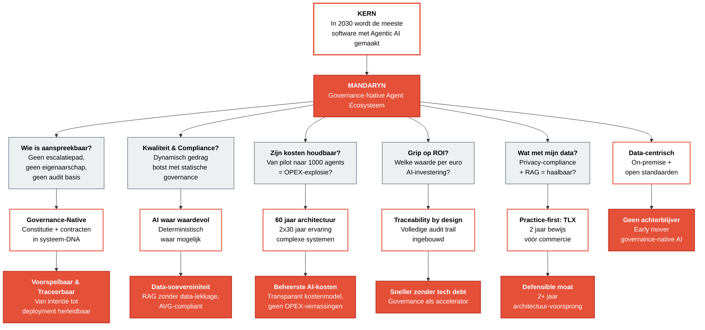
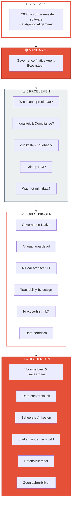
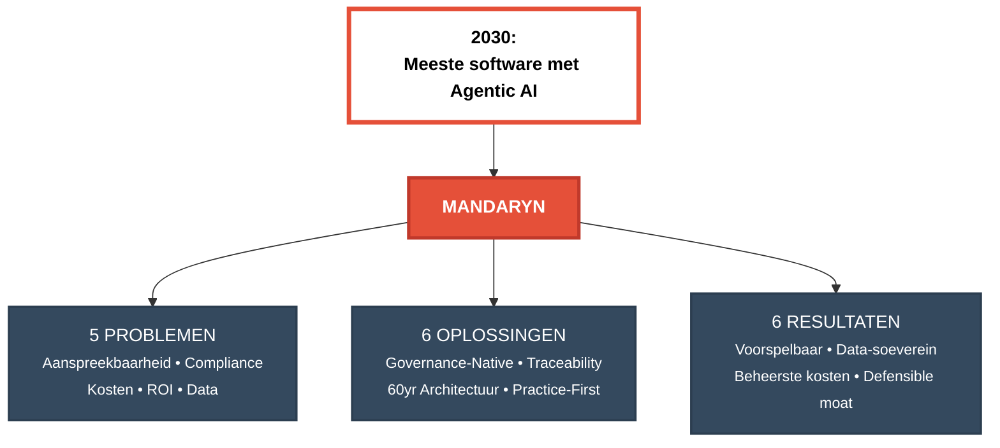

# Mandaryn Investor Visual - Mermaid Diagram

## Context: Brooks' Law of Complexity

```
┌────────────────────────────────────────────────┐
│ ESSENTIAL COMPLEXITY: inherent domein          │
│         ↓                                      │
│ ACCIDENTAL COMPLEXITY: tooling/infrastructuur  │
│         ↓                                      │
│ Nieuwe tech reduceert accidental...            │
│ MAAR essential blijft                          │
│         ↓                                      │
│ → Ambitieuzere systemen                        │
│ → Scope groeit                                 │
│ → Nieuwe abstracties                           │
│ → Nieuwe accidental complexity                 │
│                                                │
│ CONCLUSIE: COMPLEXITEIT GROEIT                 │
│           ER IS GEEN PLAYBOOK                  │
└────────────────────────────────────────────────┘
```

---

## Mandaryn Ecosystem



---

## Alternatieve weergave: Layered flowchart



---

## Simpele basis diagram (uitgebreid)

```mermaid
graph TD
    %% Styling
    classDef kernStyle fill:#ffffff,stroke:#e55039,stroke-width:4px,color:#000000,font-weight:bold
    classDef brandStyle fill:#e55039,stroke:#c0392b,stroke-width:3px,color:#ffffff,font-weight:bold
    classDef headerStyle fill:#34495e,stroke:#2c3e50,stroke-width:2px,color:#ffffff
    classDef problemStyle fill:#ecf0f1,stroke:#34495e,stroke-width:1px,color:#000000
    classDef solutionStyle fill:#ffffff,stroke:#e55039,stroke-width:2px,color:#000000
    classDef resultStyle fill:#e55039,stroke:#c0392b,stroke-width:2px,color:#ffffff
    
    %% Kern
    KERN["In 2030 wordt de meeste<br/>software met Agentic AI gemaakt"]
    
    %% Brand
    BRAND["MANDARYN<br/>Governance-Native Agent Ecosysteem"]
    
    %% Headers
    PROB_H["5 PROBLEMEN"]
    SOL_H["6 OPLOSSINGEN"]
    RES_H["6 RESULTATEN"]
    
    %% Problemen
    P1["1. Wie is aanspreekbaar?<br/><small>Geen escalatiepad, eigenaarschap, audit basis</small>"]
    P2["2. Kwaliteit & Compliance?<br/><small>Dynamisch gedrag vs statische governance</small>"]
    P3["3. Zijn kosten houdbaar?<br/><small>Van pilot naar 1000 agents = OPEX-explosie?</small>"]
    P4["4. Grip op ROI?<br/><small>Welke waarde per euro AI-investering?</small>"]
    P5["5. Wat met mijn data?<br/><small>Privacy-compliance + RAG = haalbaar?</small>"]
    
    %% Oplossingen
    S1["1. Governance-Native<br/><small>Constitutie + contracten in systeem-DNA</small>"]
    S2["2. AI waar waardevol<br/><small>Deterministisch waar mogelijk</small>"]
    S3["3. 60 jaar architectuur<br/><small>2x30 jaar ervaring complexe systemen</small>"]
    S4["4. Traceability by design<br/><small>Volledige audit trail ingebouwd</small>"]
    S5["5. Practice-first: TLX<br/><small>2 jaar bewijs vóór commercie</small>"]
    S6["6. Data-centrisch<br/><small>On-premise + open standaarden</small>"]
    
    %% Resultaten
    R1["1. Voorspelbaar & Traceerbaar<br/><small>Van intentie tot deployment herleidbaar</small>"]
    R2["2. Data-soevereiniteit<br/><small>RAG zonder data-lekkage, AVG-compliant</small>"]
    R3["3. Beheerste AI-kosten<br/><small>Transparant kostenmodel, geen OPEX-verrassingen</small>"]
    R4["4. Sneller zonder tech debt<br/><small>Governance als accelerator</small>"]
    R5["5. Defensible moat<br/><small>2+ jaar architectuur-voorsprong</small>"]
    R6["6. Geen achterblijver<br/><small>Early mover governance-native AI</small>"]
    
    %% Verbindingen
    KERN --> BRAND
    BRAND --> PROB_H
    BRAND --> SOL_H
    BRAND --> RES_H
    
    PROB_H --> P1
    PROB_H --> P2
    PROB_H --> P3
    PROB_H --> P4
    PROB_H --> P5
    
    SOL_H --> S1
    SOL_H --> S2
    SOL_H --> S3
    SOL_H --> S4
    SOL_H --> S5
    SOL_H --> S6
    
    RES_H --> R1
    RES_H --> R2
    RES_H --> R3
    RES_H --> R4
    RES_H --> R5
    RES_H --> R6
    
    %% Apply Styles
    class KERN kernStyle
    class BRAND brandStyle
    class PROB_H,SOL_H,RES_H headerStyle
    class P1,P2,P3,P4,P5 problemStyle
    class S1,S2,S3,S4,S5,S6 solutionStyle
    class R1,R2,R3,R4,R5,R6 resultStyle
```



## Compacte versie (zonder details)



---

## Hoe te gebruiken

### In MkDocs:
Deze diagrammen worden automatisch gerenderd in de MkDocs site dankzij de Mermaid extensie.

### Export als PNG/SVG:
1. Ga naar https://mermaid.live
2. Kopieer één van de Mermaid code blocks
3. Download als PNG/SVG voor gebruik in PowerPoint of andere presentaties

### In VS Code:
1. Open dit bestand in VS Code
2. Druk op Ctrl+Shift+V voor preview
3. De Mermaid diagrammen worden automatisch gerenderd

---

## Welke versie gebruiken?

- **Mandaryn Ecosystem**: Meest gedetailleerd, alle 5+6+6 punten zichtbaar
- **Layered flowchart**: Cleaner, overzichtelijke groepering
- **Simpele basis (uitgebreid)**: Beste balans tussen detail en leesbaarheid
- **Compacte versie**: Voor quick overview of executive summary

Kies de versie die het beste past bij jouw presentatie-context!
